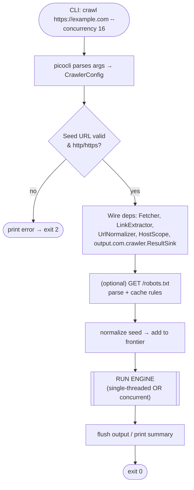
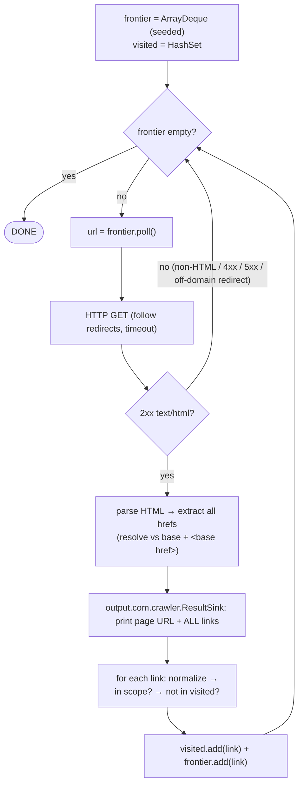
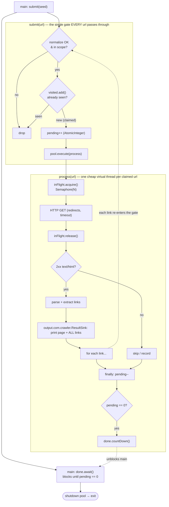

# THE PROBLEM STATEMENT 

> Create an app that can be run from the command line that will accept a base URL of a site to crawl.
> For each page it finds, the script will print the URL of the page and all of the URLs it finds on that
> page. The crawler will only process that single domain and not crawl URLs pointing to other domains or
> subdomains. Please employ patterns that will allow your crawler to run as quickly as possible, making
> full use of any patterns that might boost the speed of the task, whilst not sacrificing accuracy and
> compute resources. Do not use tools like Scrapy or Playwright. You may use libraries for other purposes
> such as making HTTP requests, parsing HTML and other similar tasks.
>
> **The objective:** This exercise is intended to allow you to demonstrate how you design software and
> write good quality code. It is important how you have structured your code and how you tested it. We also
> want to understand how you have gone about solving this problem, what tools you used to become familiar
> with the subject matter and what tools you used to produce the code and verify your work.
>
> You might also consider how you would extend your code to handle more complex scenarios, such as crawling
> multiple domains at once, thinking about how a command line interface might not be best suited for this
> purpose and what alternatives might be more suitable. Also, feel free to set up the repo as you would a
> production project.
>
> Produce a detailed discussion about your design decisions, the options you considered and the trade-offs
> you made during the development process, and aspects you might have addressed or refined if not
> constrained by time.

---

# The big picture: what is a web crawler?

A web crawler (also called a spider or bot) is a program that systematically browses the web. 
The core loop is deceptively simple:
   
1. Start with a seed URL (your base URL).
2. Download the page.
3. Parse the HTML and extract all the links (\<a href="...">).
4. Filter those links (in our case: same domain only, not already seen).
5. Add the new links to a queue ("to-visit" list).
6. Repeat until the queue is empty.
   
This is fundamentally a graph traversal problem. Think of each web page as a node and each link as a directed edge. 
The crawler is doing a breadth-first or depth-first search over a graph it discovers as it goes — it doesn't know the graph in advance.

```
   [home] ──► [about]
   │  └────► [products] ──► [product/1]
   ▼                   └──► [product/2]
   [blog] ──► [post/1]
```

The two pieces of state that make it work:
* The frontier (a.k.a. work queue): pages discovered but not yet visited.
* The visited set: pages already processed, so we never do them twice (and never loop forever on cycles like A→B→A).

# Core concepts (the building blocks)

These are the technologies/ideas the exercise wants you to demonstrate understanding of:

## HTTP requests & responses
* You fetch a page with an HTTP GET. You need to handle:
* Status codes: 200 OK (good), 3xx redirects (follow? to where?), 4xx/5xx (errors — skip/retry).
* Content-Type: only parse text/html. Skip PDFs, images, etc.
* Timeouts: a slow/dead server must not hang your whole crawler.
* Headers: setting a User-Agent is good etiquette.

## HTML parsing & link extraction
Raw HTML is messy. You use an HTML parser to build a DOM-like tree, then query for anchor tags and read their href.
Don't use regex for HTML — it breaks on real-world markup. Links can hide in \<a href>, and depending on scope \<link>, \<area>, etc.

## URL resolution & normalization
This is the most underestimated part and where accuracy is won or lost. Links on a page come in many forms:
* Absolute: https://example.com/about
* Relative: /about, about, ../about
* Protocol-relative: //example.com/about
* Non-HTTP: mailto:, tel:, javascript:, #section

You must resolve relative URLs against the page's URL, and normalize them so that 
https://example.com/a and https://example.com/a/ and https://example.com/a#top aren't treated as 
three different pages. More on this in the detailed section below.

## Domain / scope matching
Deciding whether a link is "in scope." The subtlety: www.example.com is technically a subdomain of example.com. 
The problem explicitly excludes subdomains, so this needs care.

## Concurrency & parallelism
Crawling is I/O-bound — most of the time is spent waiting for the network, not using the CPU. 
This is the key insight that lets you go fast: while one request is waiting for a response, 
you can be sending dozens of others. The patterns here (worker pools, queues, async I/O) are 
exactly what the prompt is hinting at with "patterns that will allow your crawler to run as quickly as possible."

## Politeness & resource limits
Going fast is good, but hammering a server with thousands of simultaneous requests is rude and can 
get you blocked (and the prompt says don't sacrifice "compute resources"). So you bound concurrency, 
optionally rate-limit, and respect robots.txt.

A plain-text file at the **root of a host** (`https://example.com/robots.txt`) telling bots which paths they may/may not fetch. A 1994 convention, standardised as **RFC 9309 (2022)**. Scoped to one scheme + host + port, so our single-domain crawler fetches exactly **one, once**. (Subdomains and `http` vs `https` each have their own.)

**What it contains** — groups of rules, each beginning with `User-agent` line(s) then `Allow`/`Disallow`:

| Directive | Meaning |
|---|---|
| `User-agent` | Which bot the group targets; `*` = any bot without a more specific group (matched case-insensitively). |
| `Disallow` | Path **prefix** the bot must not crawl. Empty (`Disallow:`) = nothing blocked. |
| `Allow` | Exception that re-permits a path under a broader `Disallow`. |
| `Sitemap` | Absolute URL of a sitemap (global directive, not tied to a user-agent). |
| `Crawl-delay` | Seconds between requests. **Non-standard** — Bing/Yandex honour it, Google ignores it, not in RFC 9309. |

```
User-agent: *            # any bot without a more specific group
Disallow: /admin/        # block everything under /admin/
Allow:    /admin/help    # ...except this (longest-match wins)
Crawl-delay: 5           # (non-standard) wait 5s between requests

User-agent: BadBot
Disallow: /              # BadBot may crawl nothing

Sitemap: https://example.com/sitemap.xml
```

**Matching rules (the subtle bits):**
* Only **one** group applies — the most specific `User-agent` match (groups are *not* merged).
* `Disallow` is a **prefix** match: `/cart` blocks `/cart`, `/cart/`, `/cartoon`. Anchor with `$` (`/cart$`) or widen with `*` (`/*.pdf$`).
* When `Allow` and `Disallow` both match, the **longest** (most specific) rule wins; ties favour `Allow`.

**Edge cases a crawler must handle:**
* **Missing / 404** → allow everything (common).
* **5xx / unreachable** → be conservative: assume disallow-all (RFC 9309); a cached copy may be used.
* **Cache it** (~24h, or per `Cache-Control`) — fetch once, never per URL. Parsers read at least the first 500 KiB.

**Why it's useful (ties to the brief's "compute resources"):**
* Protects the **remote** server's load and bandwidth — the resource here is *theirs*, not just ours.
* Steers bots away from **crawler traps** (infinite calendars, faceted search, session-id URLs) that could otherwise make a crawler run forever.
* Hides private / duplicate / pointless areas (admin, cart, search results, print views).
* `Sitemap` is a gift — a ready-made list of canonical URLs to seed from.
* **Critical caveat:** it's *advisory, not security*. Malicious scrapers ignore it; sensitive data needs real auth (and a `Disallow` line even advertises the path's existence).

**How it maps onto our crawler** (the "Politeness" piece — currently *hidden / bonus*, requirement #13):
1. Fetch `/robots.txt` once for the seed host at startup; parse and cache the rules.
2. A `RobotsPolicy` component, consulted in `submit()` alongside `Scope` + `visited`, drops disallowed URLs *before* any request is made.
3. `Crawl-delay` → maps to our `--delay` flag / a per-host throttle, complementing the `Semaphore` concurrency cap.
4. `Sitemap` → an optional seeding optimisation for faster, more complete discovery.
5. Build vs library: hand-roll a minimal parser (groups, longest-match, `*`/`$`) — a nice thing to *show* — or use **crawler-commons** `SimpleRobotRulesParser` (a focused utility, not a framework, so it stays within the "no Scrapy/Playwright" rule).

## Termination & deduplication
Knowing when you're done (queue empty AND no workers still finding new links) is surprisingly tricky 
once you add concurrency. And every URL must be processed exactly once.

# Breaking down the problem statement (clause by clause)

Deconstructing the prompt surfaces both the explicit and the hidden requirements.

> "Create an app that can be run from the command line that will accept a base URL of a site to crawl."

* CLI app with argument parsing. Input = one base URL.
* Hidden questions: How do you validate the URL? What if it's malformed? What flags might you expose (concurrency level, output format, timeout)?

> "For each page it finds, the script will print the URL of the page and all of the URLs it finds on that page."

* Output format: for each visited page, print that page's URL and every link found on it (all links, not just in-scope ones).
* Important distinction: what you **print** (all discovered links on a page) vs. what you **crawl next** (only same-domain links). Don't conflate them.

> "The crawler will only process that single domain and not crawl URLs pointing to other domains or subdomains."

* Scope = exact host match. If the seed is `monzo.com`, then `community.monzo.com` and `www.monzo.com` are out of scope for crawling.
* Edge case: what if `example.com` redirects to `www.example.com`? A strict reading means you'd be stuck. Worth a design note.

> "Please employ patterns that will allow your crawler to run as quickly as possible ... whilst not sacrificing accuracy and compute resources."

* The concurrency requirement, balanced against politeness / resource bounds. They want a worker-pool / bounded-concurrency design, not an unbounded "thread per URL" free-for-all.

> "Do not use tools like Scrapy or Playwright. You may use libraries for ... HTTP requests, parsing HTML ..."

* Build the crawl engine yourself (queue, visited set, concurrency, scope logic). It's fine to use an HTTP client library and an HTML parsing library. No full crawling frameworks, no headless browsers.
* Implication: this is a static crawler (no JavaScript execution). Pages that render links via JS won't expose them — an acceptable, documented limitation.

> "It is important how you have structured your code and how you tested it."

* Code quality + testing are graded explicitly. Clean separation of concerns, dependency injection (so you can test without real network calls), unit tests for the tricky logic.

> "... what tools you used to become familiar with the subject matter and what tools you used to produce the code and verify your work."

* They want a narrative: how you researched, what you used (including AI assistants — be honest), how you verified correctness.

> "... how you would extend your code ... crawling multiple domains at once ... a command line interface might not be best suited ... set up the repo as you would a production project."

* A discussion of extensions (multi-domain, distributed crawling) and interface alternatives (a service / API, a queue-based worker system).
* Production repo hygiene: README, tests, linting, CI, dependency management, maybe Docker.

> "Produce a detailed discussion about your design decisions, the options you considered and the trade-offs you made ..."

* A written design document (a `DESIGN.md` or a thorough README section). This may be weighted as heavily as the code.

## Summary of requirements

| # | Requirement | Type |
|---|-------------|------|
| 1 | CLI accepting a base URL | Explicit |
| 2 | Print each page's URL + all links on it | Explicit |
| 3 | Crawl only the exact same domain (no subdomains) | Explicit |
| 4 | Concurrent / fast, but bounded | Explicit |
| 5 | No Scrapy/Playwright; libs for HTTP/parsing OK | Constraint |
| 6 | Clean structure + tests | Explicit (graded) |
| 7 | Written design discussion | Explicit (graded) |
| 8 | Extensions discussion (multi-domain, non-CLI) | Explicit |
| 9 | Production repo setup | Explicit |
| 10 | Robust URL handling (normalization, relative, non-http) | Hidden |
| 11 | Avoid cycles / dedupe / terminate correctly | Hidden |
| 12 | Handle errors, timeouts, non-HTML content | Hidden |
| 13 | Politeness (robots.txt, rate limiting) | Hidden / bonus |

# The hard parts, in detail

These are the spots where the exercise is really testing you.

## URL normalization
To use a URL as a key in your "visited" set, you must canonicalise it. Decisions to document:
* Strip fragments: `page#section` → `page` (same document).
* Lowercase scheme and host: `HTTP://Example.COM` → `http://example.com`.
* Remove default ports: `example.com:80` → `example.com`.
* Resolve relative paths: `/a/../b` → `/b`.
* Trailing slash policy: is `/about` the same as `/about/`? (Often yes for the root, ambiguous otherwise — pick a rule and document it.)
* Query strings: keep them? Drop tracking params like `utm_*`? (Keeping them is safest for accuracy; dropping reduces duplicates.)
* Skip non-HTTP schemes: `mailto:`, `tel:`, `javascript:`, `data:`.

## Domain / subdomain matching
Given seed host `example.com`:
* ✅ `example.com/foo` — in scope
* ❌ `www.example.com` — subdomain, out of scope
* ❌ `blog.example.com` — subdomain, out of scope
* ❌ `example.org` — different domain
* ❌ `notexample.com` — must avoid naive `endsWith` bugs!

The naive `host.endsWith("example.com")` check is a classic bug — it matches `notexample.com`. The correct strict check is `host == seedHost`.

## Concurrency: the worker-pool pattern
The standard design:
* A queue of URLs to fetch (the frontier).
* A fixed pool of N workers pulling from the queue.
* Each worker: fetch → parse → extract links → for each new in-scope link, mark visited and enqueue.
* A shared, thread-safe visited set (mutex-protected map, or a concurrent set) so two workers never grab the same URL.
* Bounded N (e.g., 10–50) to cap resource use and be polite.

```
            ┌─────────────┐
            │   Frontier  │  (thread-safe queue)
            │   (queue)   │
            └──────┬──────┘
        ┌──────────┼──────────┐
        ▼          ▼          ▼
    [Worker 1] [Worker 2] ... [Worker N]
        │          │          │
        ▼          ▼          ▼
     fetch ─► parse ─► extract links
        │
        └─► filter (scope + visited) ─► enqueue new URLs
```

## Knowing when to stop
With concurrency, "queue is empty" is not sufficient — a worker might be mid-fetch and about to add 50 new URLs. You need to track in-flight work, not just queued work. Common solutions:
* A counter / WaitGroup that increments when work is enqueued and decrements when fully processed; stop when it hits zero.
* Or a coordinator that tracks `enqueued == completed`.

This is one of the most common bugs in naive crawlers — they either exit too early or hang forever.

## Robustness
* Per-request timeout (connect + read).
* Retry transient failures (with backoff) — optional.
* Only parse `Content-Type: text/html`.
* Handle redirects: a redirect to another domain means out of scope.
* Never let one bad page crash the whole run.

# High-level system design

A clean component breakdown (language-agnostic). Each box is a unit you can test in isolation:

| Component | Responsibility | Why separate? |
|-----------|---------------|---------------|
| CLI / entrypoint | Parse args, build config, start engine, print results | Thin layer; swappable for an API later |
| Fetcher | Make HTTP GET, handle timeouts / status / content-type | Mockable in tests (inject a fake HTTP client) |
| Parser / Link extractor | Turn HTML into a list of raw hrefs | Pure function: easy to unit test |
| URL normalizer + scope filter | Resolve, normalize, decide in / out of scope | Pure logic: the highest-value unit tests |
| Frontier / queue | Hold URLs to visit | Swappable (in-memory now, Redis later) |
| Visited set | Dedupe, thread-safe | Swappable for distributed store later |
| Crawler engine / coordinator | Orchestrate workers, manage concurrency & termination | The heart of the system |
| Output / Reporter | Format and emit results | Swappable (stdout, JSON, etc.) |

The key design principle: dependency injection / interfaces at the boundaries (especially the Fetcher), so your tests don't touch the real network and your components are loosely coupled. This directly serves the "clean structure + tests" requirement.

# A note on language choice

> **Decision: Java (21+).** Runner-up: Node / JavaScript. Chosen because it's the strongest language on hand (the brief grades code quality), and modern Java showcases the concurrency "patterns" the brief rewards.

## Languages considered (landscape)
* Go — arguably the best raw fit (goroutines + channels + `sync.WaitGroup`). Ruled out: no current Go experience.
* Python — `asyncio`/`aiohttp` or `ThreadPoolExecutor`; `BeautifulSoup`/`lxml`. Ruled out: skills ~10 years stale; wouldn't reflect "good quality code".
* Node.js / TypeScript — async by nature; `undici`/`fetch` + `cheerio`. Strong contender (see below).
* Java / Kotlin — richest concurrency toolkit; with virtual threads, no longer "boilerplate-heavy". **Chosen.**

## The realistic choice: Java vs JavaScript (by the *hard* parts)
The easy parts (HTTP calls, arg parsing, I/O) are a wash. The decision rides on four hard areas plus testing.

### HTML parsing & link extraction → Java
* Java: **jsoup** — best-in-class lenient parser; crucially `el.absUrl("href")` / `attr("abs:href")` resolves relative URLs against the document base **and respects `<base href>`**, solving part of the hardest accuracy problem during extraction.
* Node: cheerio (query-only — you resolve URLs yourself) / parse5 / jsdom. Good, but no built-in resolution.

### URL resolution & normalization → Node
* Node: built-in **WHATWG `URL`** (`new URL(href, base)`) — the *same algorithm browsers use*. Auto-lowercases host/scheme, strips default ports, handles punycode/percent-encoding, parses messy real-world hrefs.
* Java: `java.net.URI` is RFC-3986-strict — doesn't lowercase host, doesn't strip default ports, and **throws** on URLs that browsers accept. (Mitigation below.)

### Domain scoping (Public Suffix List) → tie
* Java: **Guava `InternetDomainName`** (`topPrivateDomain()`). Node: `tldts` / `psl`.

### Concurrency → split decision
* Node: single-threaded event loop → I/O concurrency is effortless and the **visited set needs no locks** (a whole class of bugs simply can't happen). But bounding leans on libs (`p-limit` / `p-queue`).
* Java: **virtual threads (21+)** make I/O concurrency cheap with simple blocking code; the rich toolkit (`Semaphore`, `ConcurrentHashMap.newKeySet()`, `Phaser` / `AtomicInteger` + `CountDownLatch`) lets you **demonstrate the "patterns" the brief rewards**. Price: you must get shared state right.

### Testing (graded) → Java
* Java: JUnit 5 + Mockito + AssertJ + **WireMock** (stand up a fake linked site, assert crawl behaviour deterministically).
* Node: Vitest / Jest + `nock` / `msw` / undici `MockAgent`. Good, slightly less mature for HTTP integration tests.

### Scorecard
| Hard part | Winner |
|---|---|
| HTML parsing (jsoup `abs:href`) | Java |
| URL resolution & normalization | Node (WHATWG `URL`) |
| Domain scoping (PSL) | Tie |
| Concurrency — ease / safety | Node (no locks) |
| Concurrency — demonstrating patterns | Java |
| robots.txt / politeness | Tie |
| Testing (graded) | Java |
| CLI "script" feel & distribution | Node |

## Why Java wins for *this* exercise
1. **Strongest language** → highest-quality, most idiomatic code, which is the graded dimension.
2. **Shows the concurrency engineering the brief rewards** — virtual threads + `Semaphore` + atomic visited + counter-based termination is a textbook demonstration, now clean rather than clunky.
3. **Best libraries for 2 of the 4 hard parts** (jsoup; the JUnit5 / Mockito / WireMock stack) plus Guava for scoping.

## Neutralising Java's one real weakness (URL handling)
* Resolve relative links with **jsoup `abs:href`** (lenient, `<base>`-aware) — don't push raw hrefs through `java.net.URI`.
* Canonicalise with a small, well-tested helper: lowercase scheme + host, strip default port, drop fragment, apply trailing-slash + query policy, `URI.normalize()` the path.
* Scope via **Guava `InternetDomainName`** (or exact-host match for the strict reading).
* That helper becomes a top-value unit-test target — which *plays into* the grading.
* (Optional: **Galimatias**, a WHATWG-compliant Java URL library, if browser-identical parsing is ever needed.)

# What the "extensions discussion" should cover

You don't have to build these, but discussing them earns marks:
* Multiple domains at once: scope becomes a set of allowed hosts; per-host rate limiting; per-host queues so one slow site doesn't starve others.
* Distributed crawling: replace the in-memory queue with Redis / Kafka, the visited set with a shared store (Redis / Bloom filter), run many worker instances. This is where the "CLI isn't ideal" point lands.
* Better interfaces than a CLI: a long-running service with a REST / gRPC API to submit crawl jobs and stream results; a job-queue worker model; results to a database instead of stdout.
* Persistence & resumability: checkpoint the frontier so a crashed crawl can resume.
* Politeness at scale: robots.txt caching, adaptive rate limiting, `Crawl-delay`.

# Roadmap / next steps

A path that goes concepts → breakdown → detailed design → build:
1. ✅ Concepts & problem breakdown — covered in this document.
2. ✅ Detailed design — see "Detailed design (Java)" above.
3. ⏳ Project skeleton — Gradle project, packages, picocli entrypoint, dependencies (jsoup, Guava, picocli; JUnit5 + Mockito + WireMock for tests). **← next**
4. Implement incrementally — single-threaded core first, then the virtual-thread engine.
5. Tests + production polish — README, CI (GitHub Actions), formatting (Spotless), Docker.

## Decisions (made)
* **Language: Java 21+.** Runner-up Node / JS. Full rationale in "A note on language choice".
* **Approach: incremental** — correct single-threaded core (dedupe / scope / normalization / termination + unit tests) first, then swap in the virtual-thread engine. Interfaces stay identical.
* **Scope rule: exact host match** (strict "no subdomains") — `www.` and subdomains excluded; documented with the redirect caveat.
* **Build / libs:** Gradle; jsoup (parse), Guava (domain), `java.net.http.HttpClient` (fetch), picocli (CLI); JUnit5 + Mockito + WireMock + AssertJ (test).

# Detailed design (Java)

Target runtime: **Java 21+** (virtual threads, records, sealed types, pattern matching). 
Build with **Gradle**. The core is built **single-threaded first for correctness, then made concurrent** 
— the interfaces below are identical either way; only the engine implementation changes.

## Execution flow

Everything before and after the engine is **identical** in both versions; only the engine in the middle differs.

**The lifecycle (main steps):**
1. **Parse args** (picocli) → build a `CrawlerConfig`.
2. **Validate the seed URL** (well-formed, `http`/`https`); bail early if not.
3. **Wire dependencies** — `Fetcher`, `LinkExtractor`, `UrlNormalizer`, `HostScope` (from the seed host), `output.com.crawler.ResultSink`.
4. **(Optional) robots.txt** — fetch once for the host, parse + cache.
5. **Seed the frontier** with the normalized seed URL.
6. **Run the engine** (single-threaded loop *or* concurrent) — the only part that differs.
7. **Flush output / summary**, then exit.



### Single-threaded engine
One thread, one explicit queue, one plain `HashSet`. It blocks on each request (slow), but is trivially correct — the place to nail the logic before adding concurrency. **Termination is trivial:** the loop ends when the queue is empty (the single thread can't be busy elsewhere).



### Concurrent engine (virtual threads)
Every URL passes through one **`submit()` gate** (normalize → scope → atomic claim); each claimed URL becomes a cheap virtual-thread `process()` task. Found links recurse back through the gate, so the graph fans out. A `Semaphore` caps how many requests hit the network at once; a `pending` counter + latch detect completion.



The same thing as an intuitive **runtime picture** — the gate is the dedup choke-point, and the `Semaphore` (not the thread count) bounds network load:

```
                       main thread
                            │  submit(seed)
                            ▼
          ┌──────────────────────────────────────┐
          │  submit():  normalize → in scope?      │  ◄── EVERY URL passes here
          │             visited.add()  (atomic)    │      dedup happens ONCE
          │             pending++  → pool.execute  │
          └───────────────────┬────────────────────┘
                              │ one virtual thread per *claimed* URL
        ┌──────────┬──────────┼──────────┬──────────┐
        ▼          ▼          ▼          ▼          ▼
     [task]     [task]     [task]     [task]     [task]  …1000s of cheap VTs
        │          │          │          │          │
        └──────────┴───►  Semaphore(N)  ◄┴──────────┘   ◄── only N hit the
                            │                                network at once
                  fetch → parse → print
                            │
              every found link ──► submit()   ──┐  (loops back to the gate)
                            │                    │
                       pending--                 └──────────────────────────┐
                            │                                               │
                   if pending == 0 → done.countDown()                       │
                                                                            ▼
        main: done.await()  ───────────────────────────►  wakes → shutdown, exit
```

**Termination is the subtle part:** "frontier empty" is *not* enough — a worker could be mid-fetch about to enqueue 50 children. So we count *in-flight work*: `pending` increments at the gate (when a URL is claimed) and decrements when a task fully finishes. The latch trips only when the **last** task drops it to zero — so we never exit early and never hang.

### Single vs concurrent — side by side

| Aspect | Single-threaded | Concurrent (virtual threads) |
|---|---|---|
| Engine shape | one loop over a queue | `submit()` gate + many `process()` tasks |
| Frontier | explicit `ArrayDeque` | the executor's task queue (implicit) |
| Visited set | plain `HashSet` | `ConcurrentHashMap.newKeySet()` |
| Dedup / claim | check-then-add (safe: one thread) | **atomic** `add()` returns false if seen |
| Network bound | 1 request at a time | `Semaphore(N)` caps concurrent requests |
| Termination | queue empty | `pending` counter hits 0 → latch |
| Output order | naturally ordered | interleaved → sink writes each page-block atomically |
| Speed | slow (serial waits) | fast (overlaps I/O waits — the whole point) |
| Correctness risk | low (no shared mutable state) | must get atomics + termination right |
| Role | build **first** to nail logic | swap in **after**, same interfaces |

The headline: the **boundary interfaces and the per-URL work are identical** — single-threaded is just the concurrent design with the executor / semaphore / atomics removed. That's exactly why building it first, then swapping the engine, is low-risk.

## Project / package layout
```
com.example.crawler
├── cli/            # picocli entrypoint, arg parsing, dependency wiring
│   └── CrawlCommand.java
├── core/           # orchestration
│   ├── Crawler.java            (interface)
│   ├── ConcurrentCrawler.java  (virtual-thread engine)
│   ├── CrawlerConfig.java      (record)
│   └── CrawlResult.java        (record)
├── fetch/          # HTTP
│   ├── Fetcher.java            (interface)
│   ├── HttpClientFetcher.java  (java.net.http.HttpClient)
│   └── FetchResponse.java      (sealed result)
├── parse/          # HTML -> links
│   ├── LinkExtractor.java      (interface)
│   └── JsoupLinkExtractor.java
├── url/            # the accuracy-critical logic
│   ├── UrlNormalizer.java      (interface)
│   ├── StandardUrlNormalizer.java
│   ├── Scope.java              (interface)
│   └── HostScope.java
└── output/         # reporting
    ├── output.com.crawler.ResultSink.java         (interface)
    ├── TextSink.java
    └── output.com.crawler.JsonLinesSink.java
```

## Core domain types
```java
public record CrawlerConfig(
        URI seed,
        int maxConcurrentRequests,  // Semaphore permits, e.g. 16
        Duration requestTimeout,    // per request, e.g. 10s
        String userAgent,
        int maxPages,               // safety cap; 0 = unlimited
        boolean respectRobotsTxt,
        Duration politenessDelay) { // per-request delay; ZERO = none
}

/** What we print for each crawled page: its URL + every link found on it. */
public record CrawlResult(URI pageUrl, List<URI> links) {}
```

## Component interfaces (the testability seams)
Everything the engine uses to touch the outside world is an interface, so tests inject fakes and never hit the network.

```java
public interface Fetcher {
    FetchResponse fetch(URI url);   // never throws; failures are encoded in the result
}

public sealed interface FetchResponse {
    record Html(URI finalUrl, String body) implements FetchResponse {}            // 2xx + text/html
    record Skipped(URI finalUrl, String contentType) implements FetchResponse {}  // 2xx, non-HTML
    record Failed(URI url, String reason) implements FetchResponse {}             // non-2xx / timeout / IO
}

public interface LinkExtractor {
    List<URI> extract(String html, URI baseUrl);   // all hrefs, resolved + de-duped within the page
}

public interface UrlNormalizer {
    Optional<URI> normalize(URI url);   // canonical form, or empty if the URL should be ignored
}

public interface Scope {
    boolean inScope(URI normalizedUrl);
}

public interface output.com.crawler.ResultSink {
    void accept(CrawlResult result);    // thread-safe; emits one page's block atomically
}
```

Why a sealed `FetchResponse`: the engine `switch`-es over it with exhaustive pattern matching — the compiler guarantees every case (HTML / skipped / failed) is handled, and error handling stays out of exceptions.

## URL normalization — the algorithm
`StandardUrlNormalizer.normalize(URI)`:
1. **Scheme** must be `http`/`https` (compare lower-cased); else return empty → drops `mailto:`, `tel:`, `javascript:`, `data:`, and fragment-only `#...` links.
2. **Lowercase the host.**
3. **Strip the default port** (`80` for http, `443` for https).
4. **Drop the fragment** (`#section`).
5. **Normalise the path** with `URI.normalize()` (resolves `.` / `..`); empty path → `/`.
6. **Trailing-slash policy (documented default):** leave the path as-is apart from rule 5 — treating `/a` and `/a/` as the same risks merging genuinely distinct resources. *Alternative:* strip trailing slash except on root, ideally driven by observed redirects.
7. **Query policy (documented default):** keep the query verbatim (accuracy first). *Optional flag:* strip tracking params (`utm_*`, `fbclid`, …) to cut duplicates.
8. Rebuild and return the canonical `URI`.

This pure function is the single highest-value unit-test target.

## Scope — exact-host matching
```java
public final class HostScope implements Scope {
    private final String seedHost;   // normalized, lower-cased

    public HostScope(URI seed) { this.seedHost = seed.getHost().toLowerCase(); }

    @Override public boolean inScope(URI url) {
        return url.getHost() != null && seedHost.equals(url.getHost().toLowerCase());
    }
}
```
* Strict "no subdomains" reading → **exact host equality**. This correctly excludes `www.example.com` / `blog.example.com`, and avoids the classic `endsWith("example.com")` bug that wrongly matches `notexample.com`.
* **www / redirect caveat:** if the seed is `example.com` but it (or its links) point to `www.example.com`, those are out of scope. Document this; a `--include-www` toggle, or seeding the canonical host, is the pragmatic escape hatch.
* The multi-domain extension swaps `HostScope` for a `Scope` backed by a set of hosts, or Guava `InternetDomainName.topPrivateDomain()` (registrable-domain matching — which *would* include subdomains).

## Concurrency model — recommended: task-per-virtual-thread
Engine state:
```java
ExecutorService pool   = Executors.newVirtualThreadPerTaskExecutor();
Semaphore inFlight     = new Semaphore(config.maxConcurrentRequests()); // bounds concurrent HTTP
Set<URI> visited       = ConcurrentHashMap.newKeySet();                 // atomic dedupe + claim
AtomicInteger pending  = new AtomicInteger();                           // submitted-but-not-done tasks
CountDownLatch done    = new CountDownLatch(1);                         // tripped when pending hits 0
```

Submit (claims a URL exactly once):
```java
void submit(URI raw) {
    normalizer.normalize(raw)
        .filter(scope::inScope)
        .filter(visited::add)   // newKeySet().add() is atomic → no check-then-act race
        .ifPresent(u -> {
            pending.incrementAndGet();
            pool.execute(() -> process(u));
        });
}
```

Process one page:
```java
void process(URI url) {
    try {
        inFlight.acquire();          // cap concurrent requests (politeness + resources)
        FetchResponse resp;
        try { resp = fetcher.fetch(url); }
        finally { inFlight.release(); }

        if (resp instanceof FetchResponse.Html html) {
            List<URI> links = extractor.extract(html.body(), html.finalUrl());
            sink.accept(new CrawlResult(html.finalUrl(), links)); // print page + ALL links
            links.forEach(this::submit);                          // only in-scope links survive submit()
        }
        // Skipped / Failed: nothing to enqueue (optionally log)
    } catch (InterruptedException e) {
        Thread.currentThread().interrupt();
    } catch (RuntimeException e) {
        // one bad page must never kill the crawl
    } finally {
        if (pending.decrementAndGet() == 0) done.countDown();     // precise termination
    }
}
```

Run:
```java
public void crawl() throws InterruptedException {
    submit(config.seed());
    if (pending.get() == 0) return;  // seed invalid / out of scope
    done.await();                    // blocks until the LAST in-flight task finishes
    pool.shutdown();
}
```

Why this design:
* **Virtual threads** → one cheap thread per task; blocking `fetch()` is fine, no callback spaghetti.
* **`Semaphore`** bounds *concurrent network requests* (resources + politeness), decoupled from thread count.
* **`visited.add()`** returns `false` if already present → **atomic dedupe + claim** in one step; two workers never grab the same URL.
* **`pending` counter + latch** solve the "knowing when to stop" problem precisely: we finish only when the last task completes, so we never exit while a worker might still enqueue children, and never hang.
* **No explicit queue** — the executor *is* the frontier. (For distributed mode, extract `Frontier` + `VisitedSet` interfaces backed by Redis — see extensions.)

**Output ordering:** concurrent workers writing to stdout would interleave. `output.com.crawler.ResultSink` emits each page's block as one synchronized write (build the full string, then one locked `print`), or pushes `CrawlResult`s onto a `BlockingQueue` drained by a single reporter thread. Output stays readable.

### Alternative: classic fixed worker-pool + `BlockingQueue`
N threads `take()` from a shared queue and enqueue discoveries. Valid, but termination needs an idle-detector (active-workers == 0 && queue empty) or poison pills — the usual source of "exits early / hangs forever" bugs. With virtual threads, the counter approach above is simpler and just as fast.

### Single-threaded first (the build order)
Identical interfaces; the engine becomes a loop over an `ArrayDeque` with a plain `HashSet` visited — no executor, semaphore, or atomics. Nail correctness (normalization, scope, dedupe, termination) with fast unit tests, then swap in the concurrent engine. Nothing else changes.

## HTTP fetching (`HttpClientFetcher`)
Built-in `java.net.http.HttpClient` (no extra dependency, plays nicely with virtual threads):
* `connectTimeout` on the client; per-request `timeout(config.requestTimeout())`.
* `followRedirects(Redirect.NORMAL)`; read the **final** URL from `response.uri()` and re-check scope before parsing.
* Inspect `statusCode()` (2xx only) and `Content-Type` (`text/html`) → map to `Html` / `Skipped` / `Failed`.
* Set the `User-Agent` header from config.

## Configuration & CLI flags (picocli)
| Flag | Default | Purpose |
|---|---|---|
| `<url>` (positional) | — | Seed URL (required) |
| `--concurrency` | 16 | `Semaphore` permits (max concurrent requests) |
| `--timeout` | 10s | Per-request timeout |
| `--max-pages` | 0 (∞) | Safety cap |
| `--user-agent` | `crawler/1.0` | UA header |
| `--format` | `text` | `text` or `json` |
| `--respect-robots` | true | Honour robots.txt |
| `--delay` | 0 | Politeness delay per request |

## Output format
Plain text (default) — each page, then every link found on it:
```
https://example.com/
  -> https://example.com/about
  -> https://example.com/products
  -> https://twitter.com/example        (off-domain: printed, not crawled)
https://example.com/about
  -> https://example.com/
  -> https://example.com/contact
```
`--format json` emits one JSON object per line (`{"page": "...", "links": [...]}`) for piping / machine consumption.

## Error handling & robustness
* Per-request connect + read timeout; failures → `Failed`, logged, crawl continues.
* Only parse `Content-Type: text/html`; everything else → `Skipped`.
* Redirects followed; final URL re-checked against `Scope` before printing/parsing.
* Malformed HTML handled by jsoup's lenient parser; unparseable hrefs dropped by the normalizer.
* `maxPages` hard cap prevents runaway crawls.
* *Optional extension:* retry 5xx / timeouts with exponential backoff.

## Test plan
Tools: **JUnit 5, AssertJ, Mockito, WireMock**; **Gradle**; **JaCoCo** for coverage.

**Unit (pure logic — highest value):**
* `StandardUrlNormalizer`: fragment stripped; default port stripped; host/scheme lower-cased; `/a/../b` → `/b`; trailing-slash policy; query kept; `mailto:`/`tel:`/`javascript:`/`data:` dropped; protocol-relative resolved; **idempotency** (`normalize(normalize(x)) == normalize(x)`).
* `HostScope`: exact host in; `www.`/`blog.` subdomain out; `notexample.com` out (no `endsWith` bug); different TLD out; case-insensitive host.
* `JsoupLinkExtractor`: relative / absolute / protocol-relative; `<base href>` honoured; within-page dedupe; non-anchor ignored; malformed HTML; empty `href`.

**Component (fakes / mocks):**
* Fake `Fetcher` serving an in-memory page graph → assert every page visited once and output contains page + links.
* Cycle graph A→B→A → terminates, each page once.
* Out-of-scope links printed but not fetched (fake records fetched URLs).

**Integration (WireMock — real HTTP against a fake site):**
* Multi-page linked site → end-to-end crawl correctness.
* 301 to same domain (followed) vs to another domain (printed, not crawled).
* Non-HTML (`application/pdf`) → skipped.
* 404 / 500 → counted failed, crawl continues.
* Slow endpoint > timeout → `Failed`, no hang.

**Concurrency correctness:**
* Generated graph (~1k pages), run repeatedly → visited count == unique pages; run completes (no deadlock / early exit).
* Fake fetcher counts hits per URL; assert all == 1 (no duplicate fetches).
